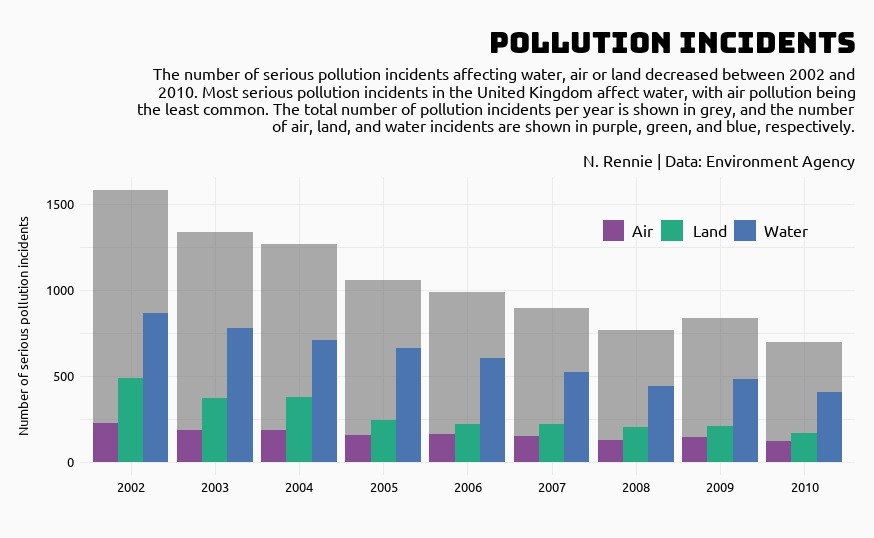

# 2022 30 Day Chart Challenge

A repository containing code for the #30DayMapChallenge. Check out the challenge at [twitter.com/30DayChartChall](https://twitter.com/30DayChartChall?ref_src=twsrc%5Egoogle%7Ctwcamp%5Eserp%7Ctwgr%5Eauthor). You can also see my contributions for the challenge on twitter at [@nrennie35](https://twitter.com/nrennie35) from April 1 2022.

## Day 1 (Part to whole) made with R

## Day 2 (Pictogram) made with R

## Day 3 (Historical) made with R

## Day 4 (Flora) made with Tableau (left) and R (right)

 

## Day 5 (Slope) made with R

## Day 6 (Our World in Data) made with R

## Day 7 (Physical) made with R

## Day 8 (Mountains) made with Figma

## Day 9 (Statistics) made with R

## Day 10 (Experimental) made with R

## Day 11 (Circular) made with R

## Day 12 (The Economist) made with R

## Day 13 (Correlation) made with R

## Day 14 (3-Dimensional) made with Python and R

## Day 15 (Multivariate) made with R

## Day 16 (Environment) made with R

## Day 17 (Connections) made with R

## Day 18 (OECD) made with R

## Day 19 (Global Change) made with R

## Day 20 (New Tool) made with Inkscape

## Day 21 (Down and Upwards) made with R

## Day 22 (Animation) made with R

## Day 23 (Tiles) made with R

## Day 24 (Financial Times) made with R

## Day 25 (Trend) made with R

## Day 26 (Interactive) made with R

## Day 27 (Future) made with R 

## Day 28 (Deviations) made with RAWgraphs and Inkscape

## Day 29 (Storytelling) made with R and Inkscape

## Day 30 (UN Population) made with R

