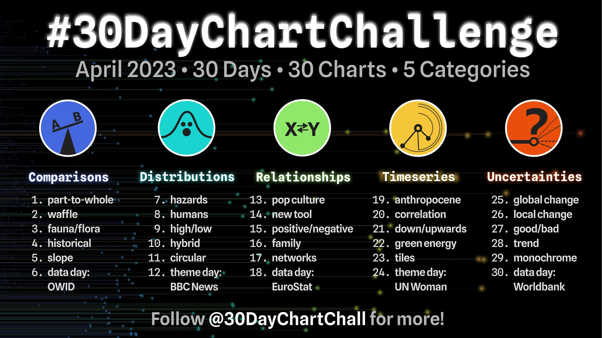
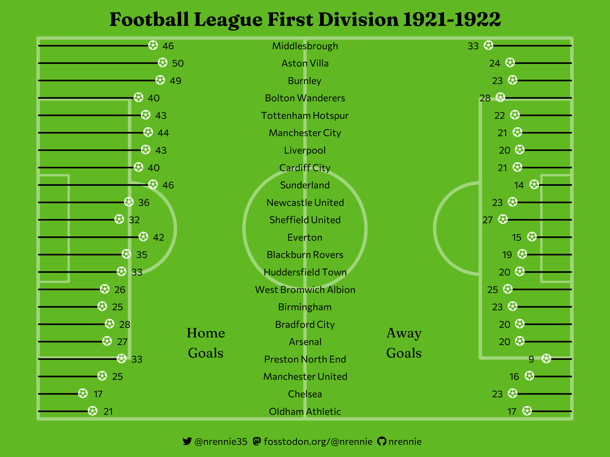
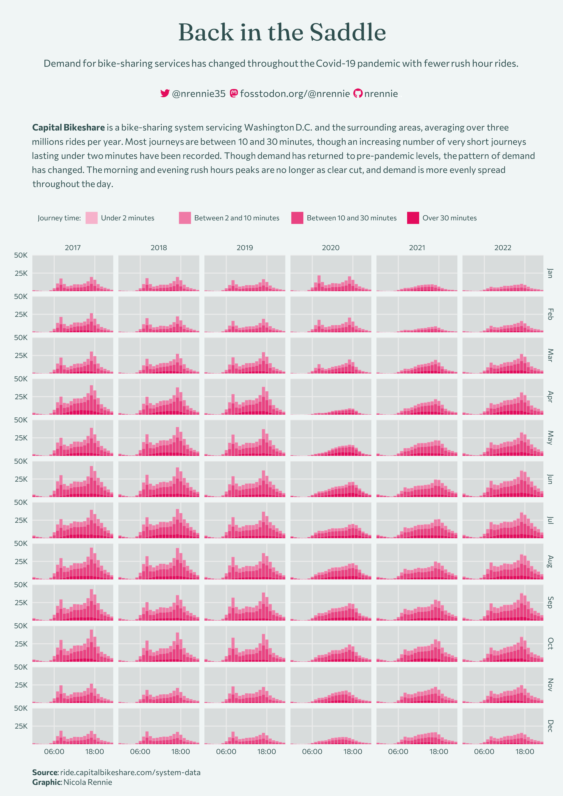

# 2023 30 Day Chart Challenge

A repository containing code for the #30DayMapChallenge. Check out the challenge at [twitter.com/30DayChartChall](https://twitter.com/30DayChartChall?ref_src=twsrc%5Egoogle%7Ctwcamp%5Eserp%7Ctwgr%5Eauthor). You can also see my contributions for the challenge on twitter at [@nrennie35](https://twitter.com/nrennie35) from April 1 2023.

## Day 4 (Historical) made with R

## Day 28 (Trend) made with R

