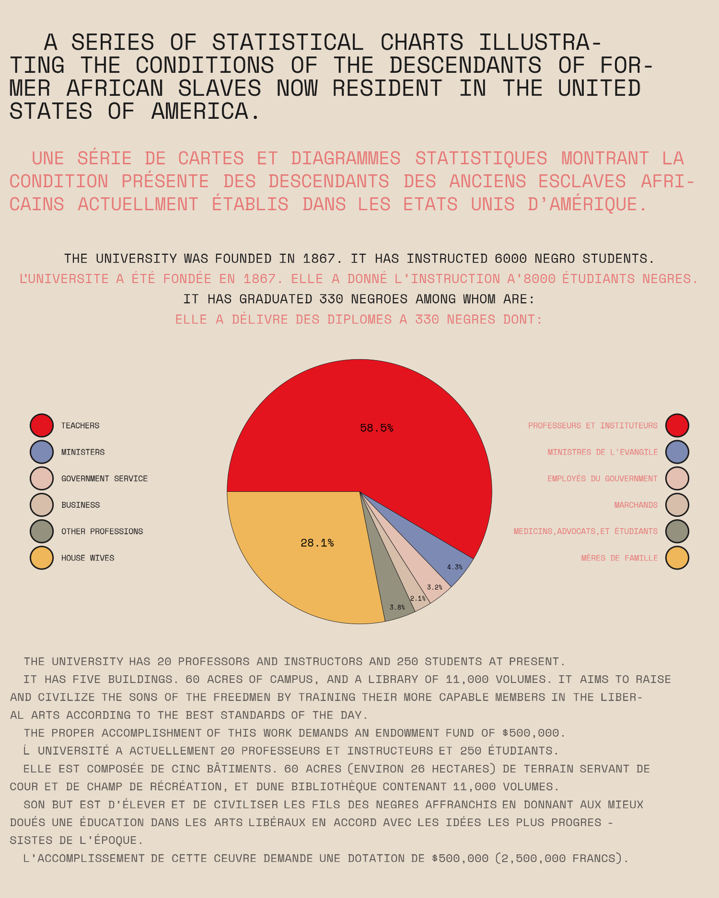
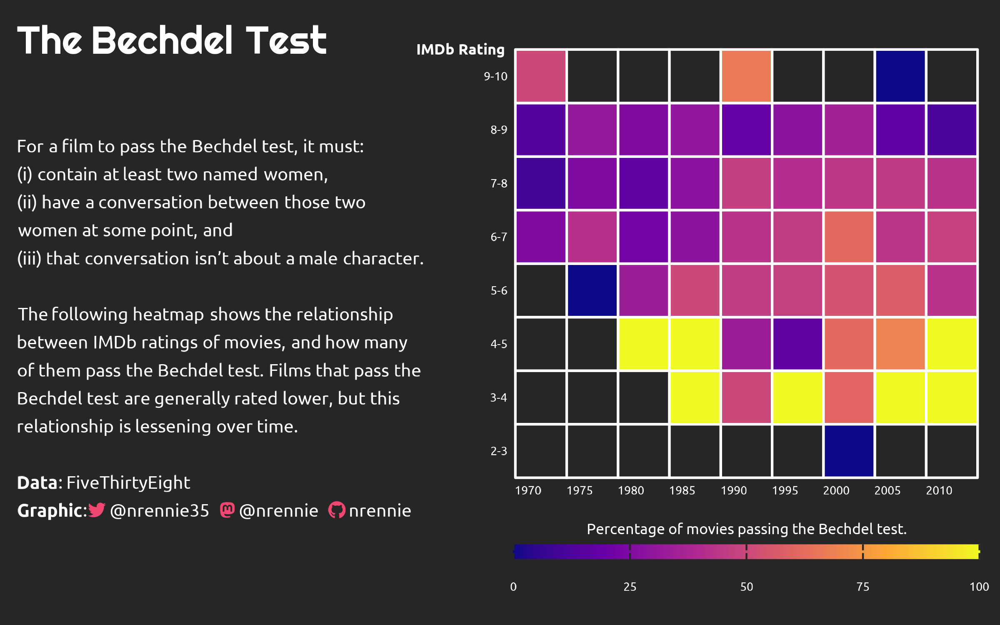
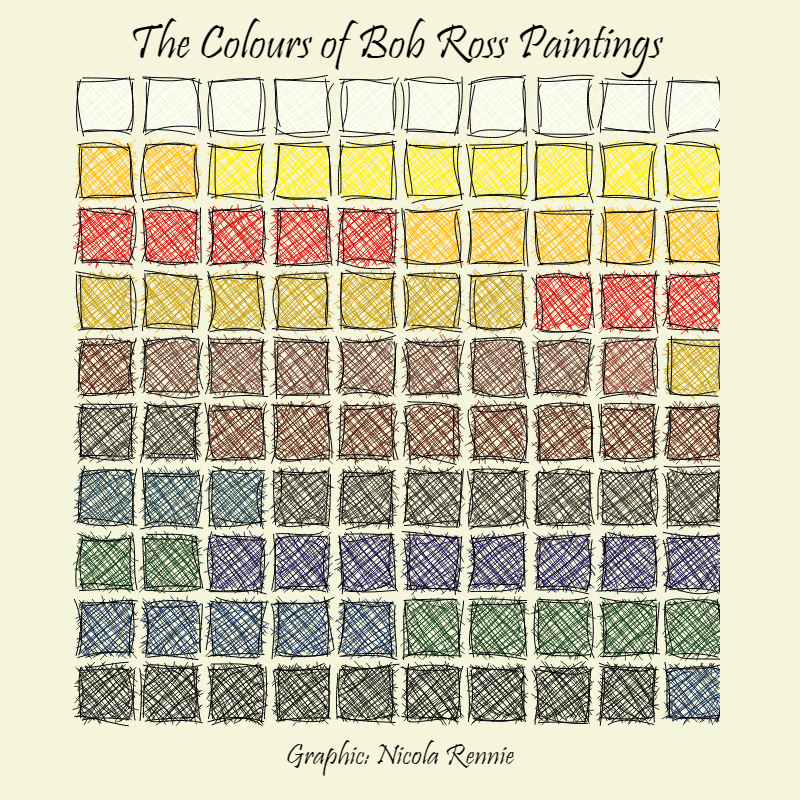
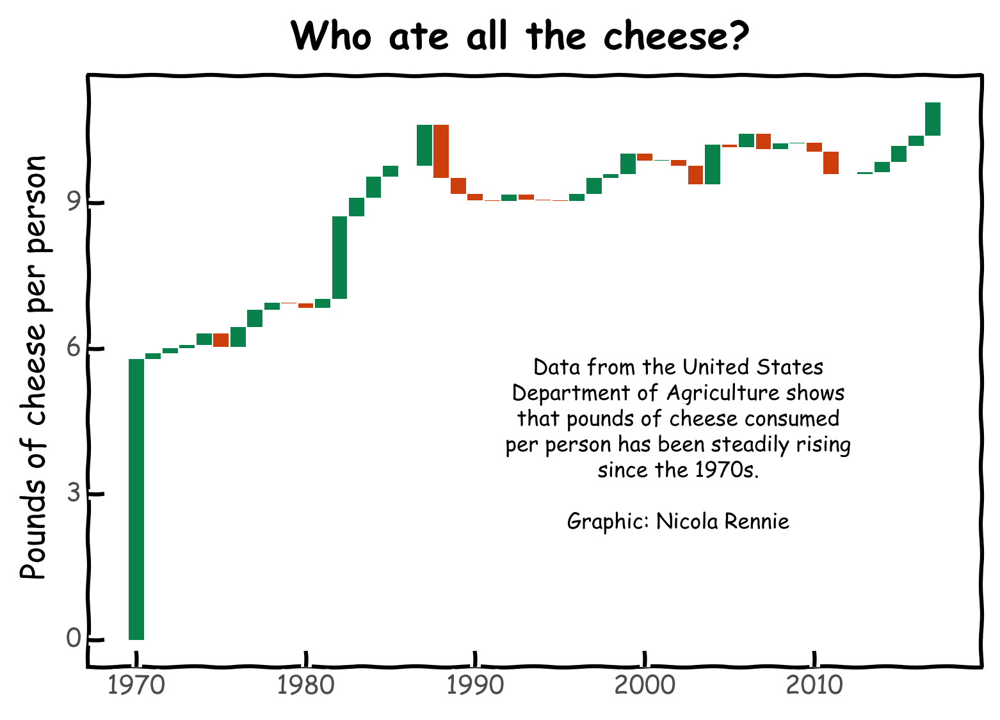
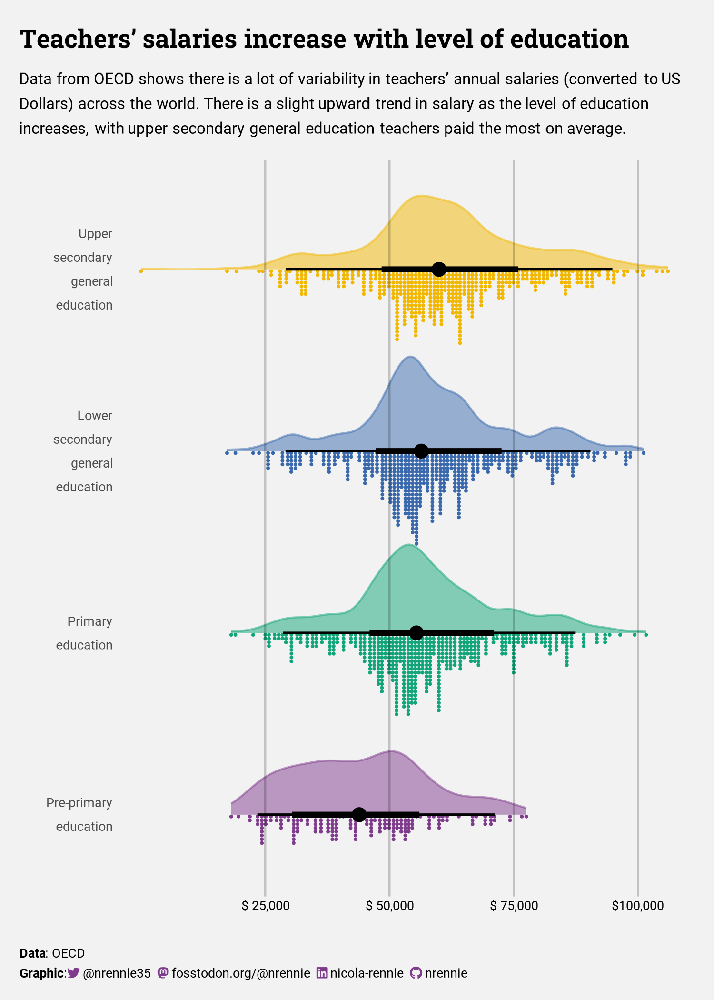

# 2024 30 Day Chart Challenge

A repository containing code for the #30DayMapChallenge. Check out the challenge on [GitHub](https://github.com/30DayChartChallenge/Edition2024). You can also see my contributions for the challenge on [Twitter](https://twitter.com/nrennie35), [Mastodon](https://fosstodon.org/@nrennie), or [BlueSky](https://bsky.app/profile/nrennie.bsky.social) from April 1 2024.

## Day 1 (Part to whole) in R

## Day 2 (Neo) in R

## Day 3 (Makeover) in R

## Day 4 (Waffle) in R

## Day 5 (Diverging) in Python

## Day 6 (OECD) in R

