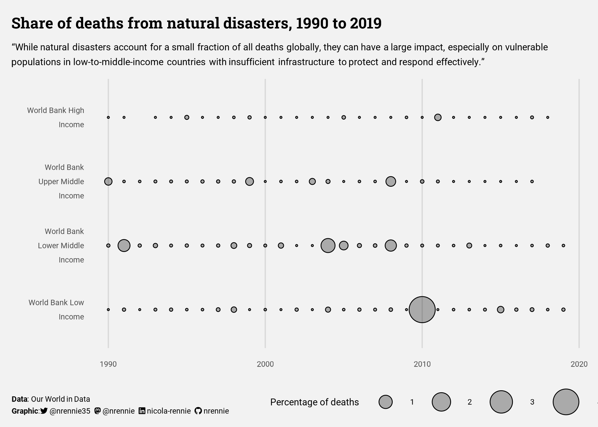
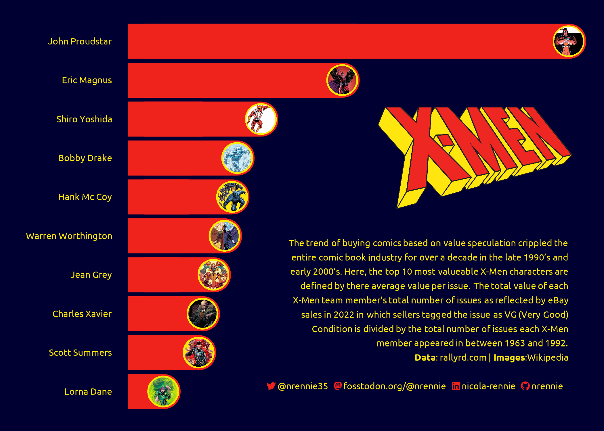
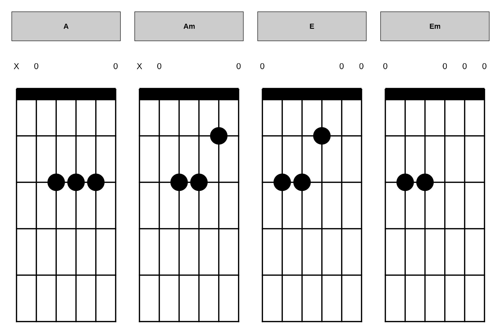
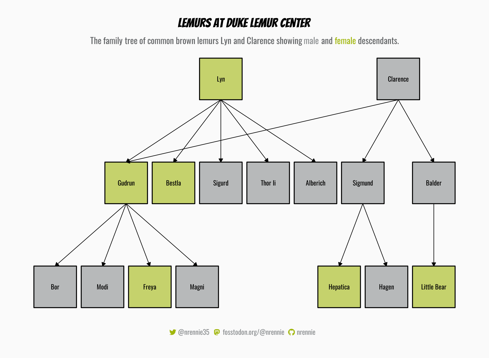
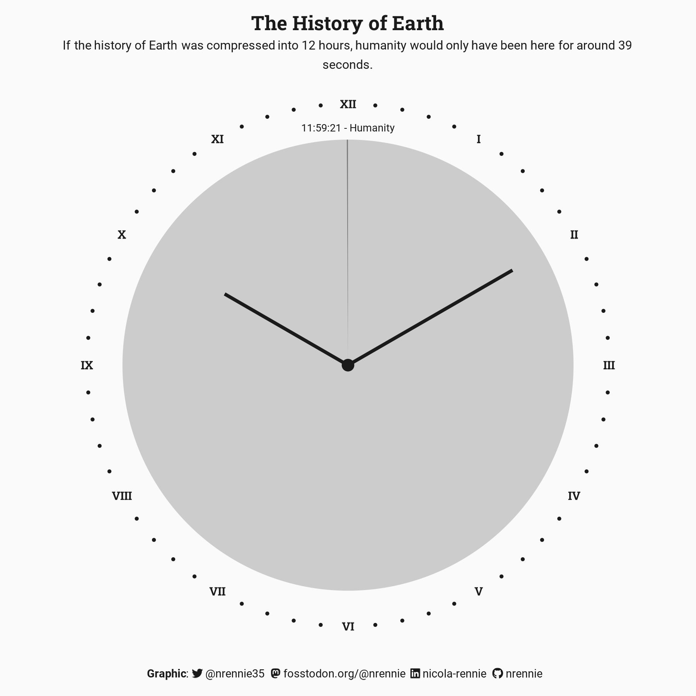
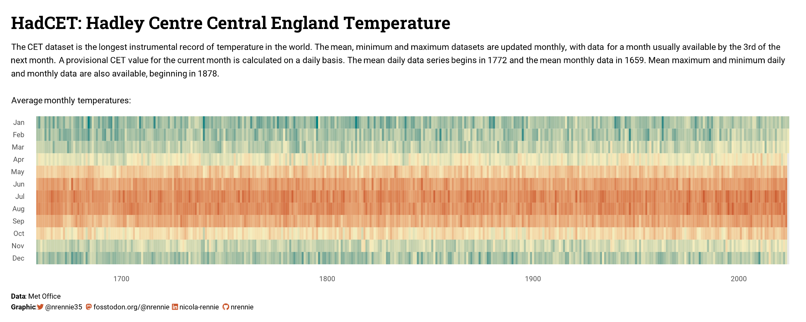

# 2024 30 Day Chart Challenge

A repository containing code for the #30DayMapChallenge. Check out the challenge on [GitHub](https://github.com/30DayChartChallenge/Edition2024). You can also see my contributions for the challenge on [Twitter](https://twitter.com/nrennie35), [Mastodon](https://fosstodon.org/@nrennie), or [BlueSky](https://bsky.app/profile/nrennie.bsky.social) from April 1 2024.

## Day 1 (Part to whole) made with R

## Day 2 (Neo) made with R

## Day 3 (Makeover) made with R

## Day 4 (Waffle) made with R

## Day 5 (Diverging) made with Python

## Day 6 (OECD) made with R

## Day 7 (Hazards) made with R

## Day 8 (Circular) made with R

## Day 9 (Major / Minor) made with R

## Day 10 (Physical) made with Crochet

## Day 11 (Mobile-friendly) made with R

## Day 13 (Family) made with R

## Day 14 (Heatmap) made with R

## Day 15 (Historical) made with R

## Day 16 (Weather) made with R

