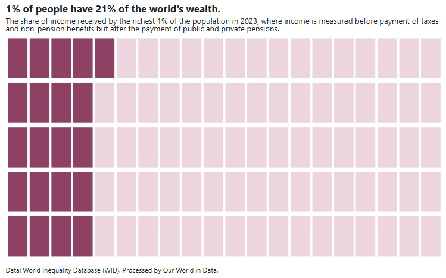
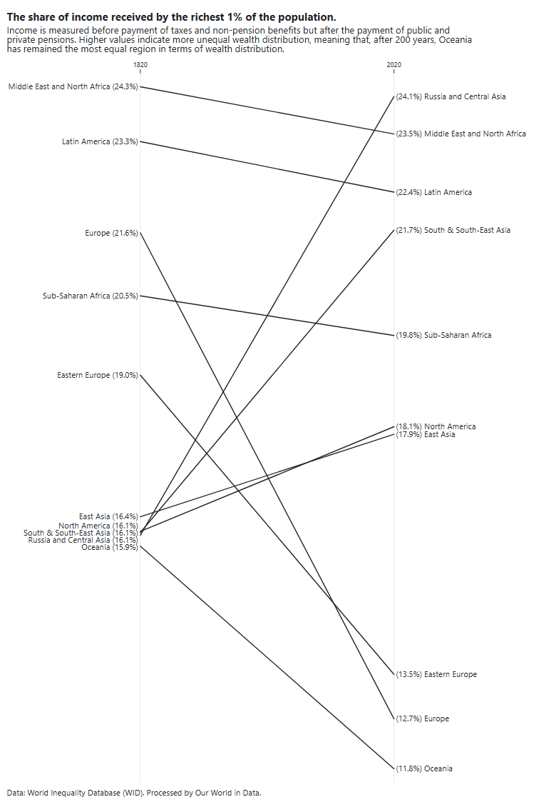
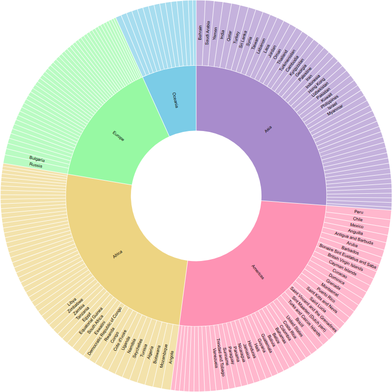
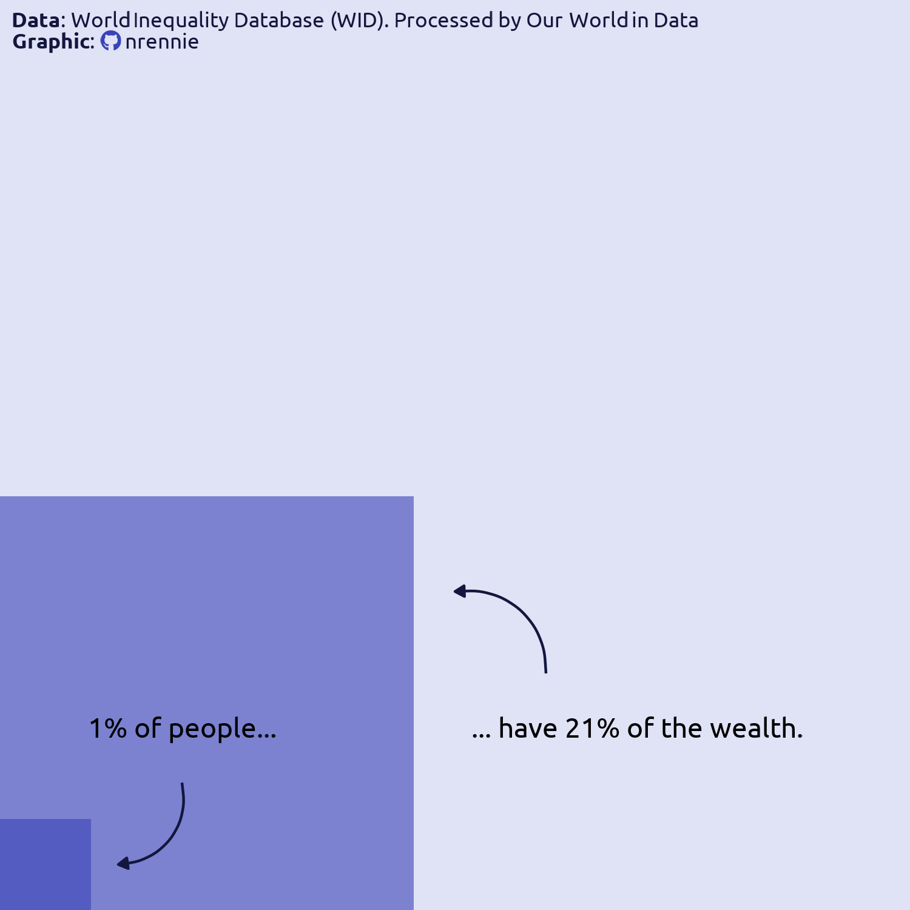
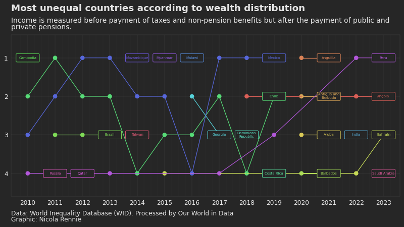
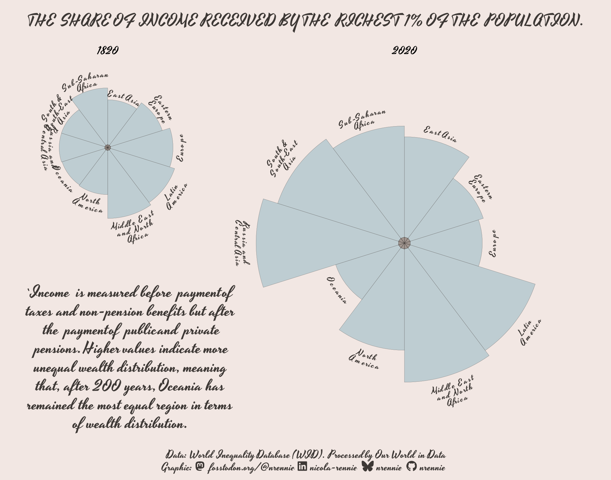
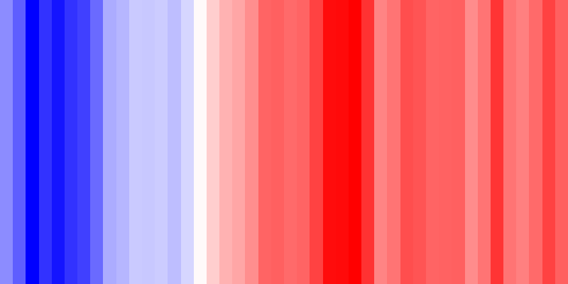

# 2025 30 Day Chart Challenge

A repository containing code for the #30DayMapChallenge. Check out the challenge on [GitHub](https://github.com/30DayChartChallenge/Edition2025). You can also see my contributions for the challenge on [LinkedIn](https://www.linkedin.com/in/nicola-rennie/), [Mastodon](https://fosstodon.org/@nrennie), or [BlueSky](https://bsky.app/profile/nrennie.bsky.social) from April 1 2025.

## Day 1 (Fractions) made with Observable

 

## Day 2 (Slope) made with Observable

 

## Day 3 (Circular) made with Observable

## Day 4 (Big or Small) made with R

 

## Day 5 (Ranking) made with Python

 

## Day 6 (Florence Nightingale Theme) made with R

 

## Day 11 (Stripes) made with Python

 
