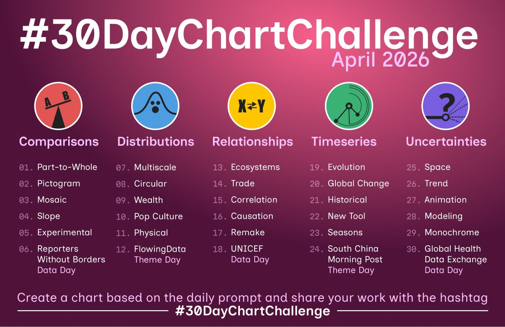
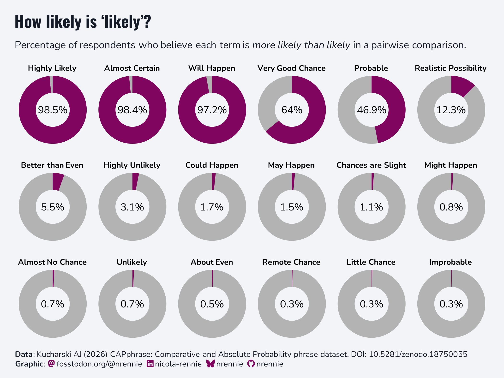
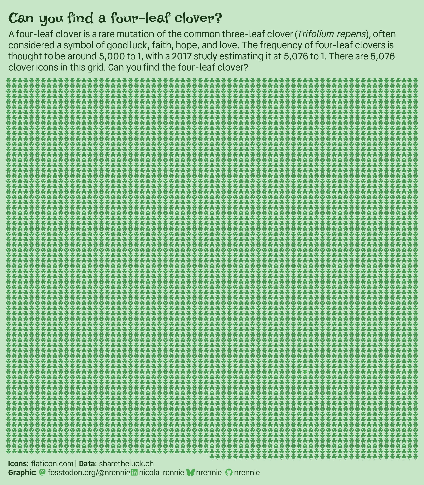
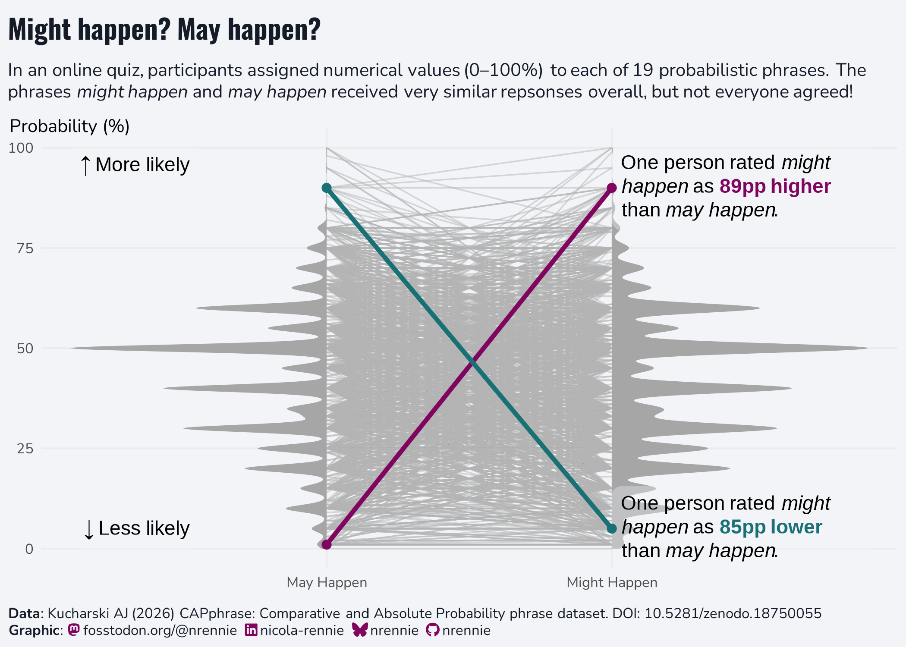
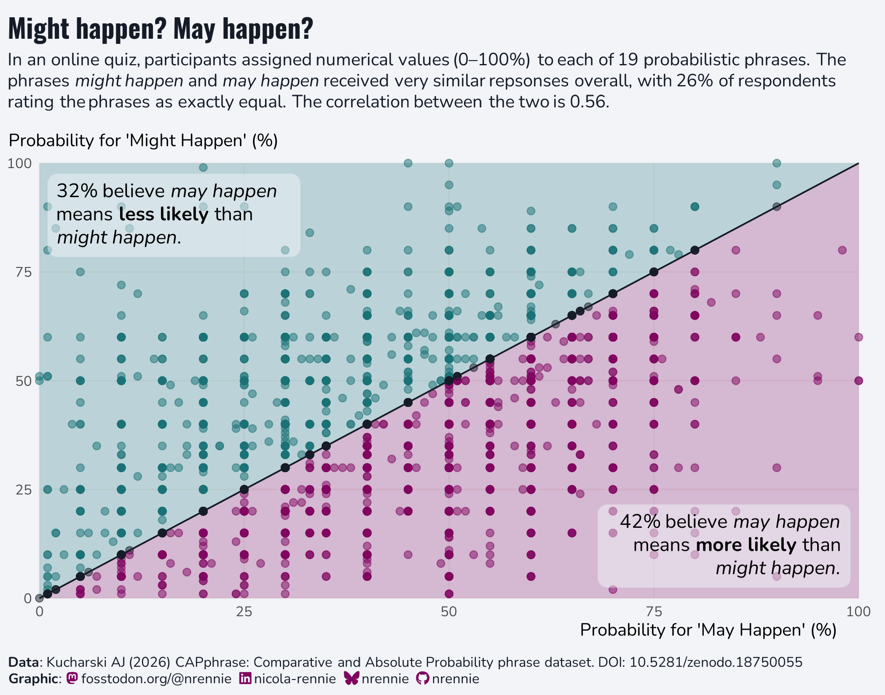
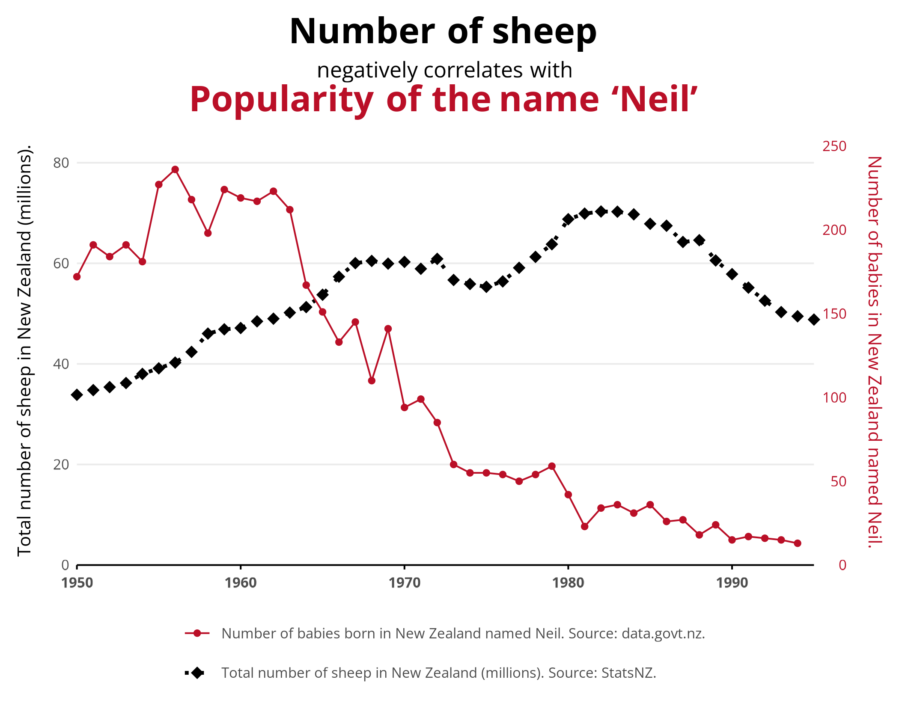
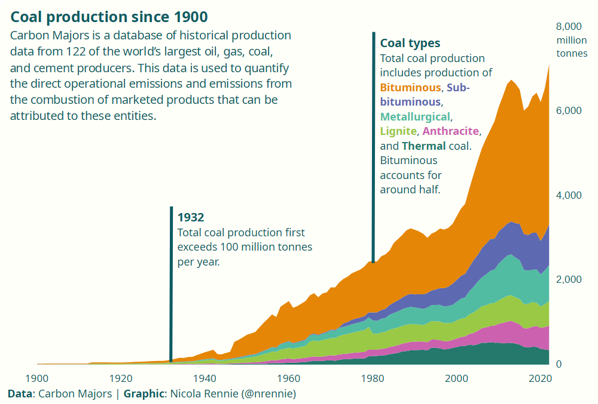
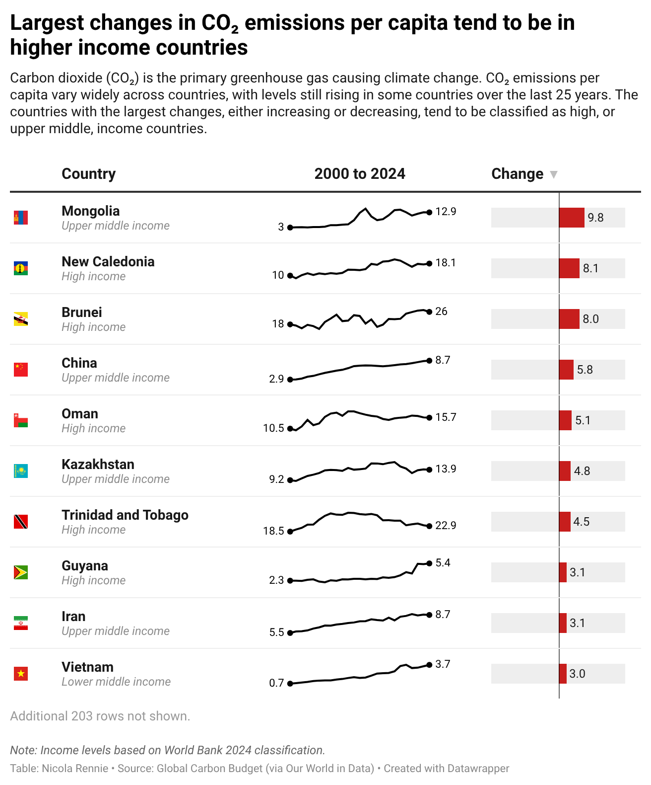

# 2026 30 Day Chart Challenge

A repository containing code for the #30DayChartChallenge. Check out the challenge on [GitHub](https://github.com/30DayChartChallenge/Edition2026). You can also see my contributions for the challenge on [LinkedIn](https://www.linkedin.com/in/nicola-rennie/), [Mastodon](https://fosstodon.org/@nrennie), or [BlueSky](https://bsky.app/profile/nrennie.bsky.social) from April 1 2026.

## Day 1 (Part to Whole) made with R

 

## Day 2 (Pictogram) made with R

 

## Day 4 (Slope) made with R

 

## Day 15 (Correlation) made with R

 

## Day 16 (Causation) made with R

 

## Day 17 (Remake) made with LibreOffice Calc

 

## Day 22 (New Tool) made with Datawrapper

 
